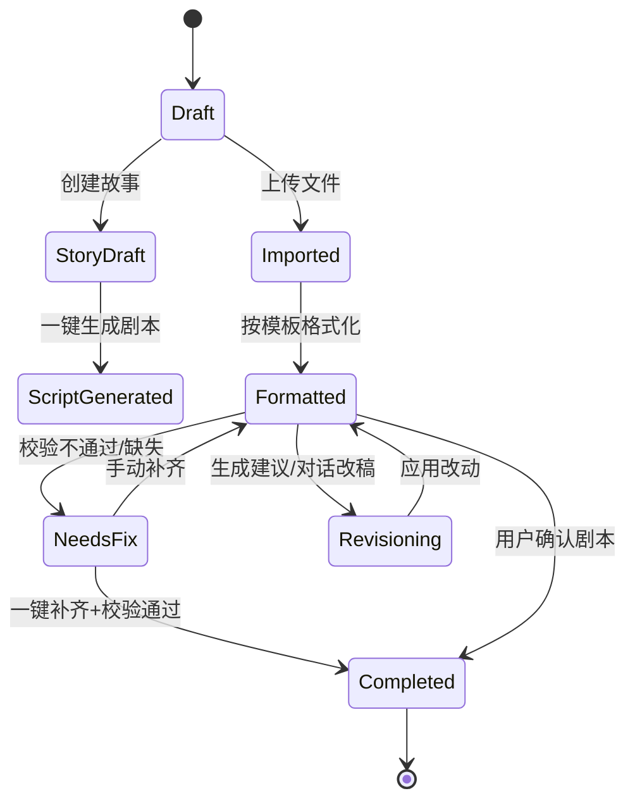
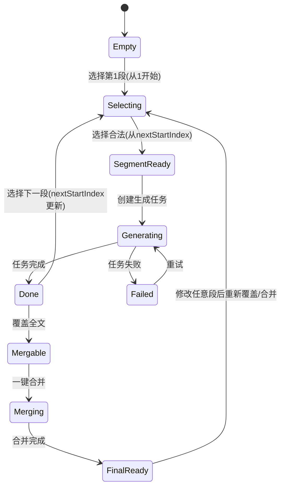

# PRD：短剧生成 Web 端应用（v1.0，AI 友好）

## 0. 安全与合规（强制）

- 用户可能会在需求或设置中提供 LinkAPI Key 等敏感信息；系统不得在日志、埋点、错误信息、分享链接、导出文件中明文暴露。
- Key 仅允许用户在「设置中心」录入；存储策略：
  - 无账号体系：仅本地安全存储（浏览器安全存储/OS Keychain 方案择一）。
  - 有账号体系：服务端加密存储（KMS/密钥分离），前端永不持久化明文。
- 任何对外导出的文件（docx、json、项目包）必须进行密钥脱敏与剔除。

## 1. 背景与目标

### 1.1 产品目标

- 用户从「故事/文本/Word」出发，按 4 步生成可合并的短剧视频，并且每一步结果可追溯、可多版本、可回滚、可二次编辑。

### 1.2 核心约束

- 所有模型调用统一通过 LinkAPI 进行中转；凡涉及模型调用的地方，用户必须能手动选择 LinkAPI 支持的模型。
- 剧本必须符合指定 Word 模板的结构与标记规范（见「6. 模板契约」）。
- 视频生成分 4 步：剧本 → 三视图素材 → 分段视频 → 合并成片；成片后片段仍保留并可再合并。

### 1.3 关键成功指标（可度量）

- Step1：模板校验通过率、从上传到可进入 Step2 的转化率、用户补齐次数与耗时
- Step2：素材生成成功率、每类素材被“确认”的比例、重生成次数分布
- Step3：分段覆盖完成率、单段生成成功率、预览使用率、合并成功率
- Step4：成片再次合并率、回到 Step3 修改率、导出/下载完成率

### 1.4 用户体系（新增）

- 采用最简注册登录流程，降低使用门槛。
- **注册**：仅需输入账号（用户名/邮箱）和密码即可完成注册，无需验证码、手机号等验证。
- **登录**：输入账号和密码进行身份验证。
- **权限**：未登录用户无法进入项目列表，需跳转至登录页。

## 2. 用户画像与使用场景

- U1 内容创作者：有故事但不会写标准格式；需要一键结构化、补齐、改稿。
- U2 工作室制作：强调角色/道具/场景一致性与可控性；需要素材库、版本管理、可复用。
- U3 新手：只输入几句话，依赖 AI 生成故事→剧本→视频的完整流水线。

## 3. 术语

- Project：一个短剧项目（含剧本、素材库、分段视频、合并成片）。
- Script Template：指定「短剧空白剧本模板（AI生剧专用·动作+对话+心理画外音穿插版）」。
- Asset Library：角色/道具/场景与其三视图、角色形象图等集合。
- Segment：按剧本文字顺序切分的一个视频片段（强制连续不重叠）。
- Version：同一资产/片段的多次生成结果（历史不删除）。

## 4. 总体信息架构（IA）与路由

### 4.1 页面列表

- P0 注册/登录页
- P1 项目列表 / 最近项目
- P2 新建项目向导（选择：上传文本/创建故事）
- P3 Step1 剧本工作台（导入/生成/格式化/补齐/改稿/校验/预览）
- P4 Step2 素材库工作台（提取清单→三视图→角色形象→确认→创建素材库）
- P5 Step3 分段视频工作台（连续选段→生成→修改→预览→合并）
- P6 Step4 成片页（成片播放、片段管理、再次合并）
- P7 设置中心（LinkAPI Endpoint/Key/默认模型/并发/存储策略）

### 4.2 路由建议

- `/login`
- `/register`
- `/projects`
- `/projects/new`
- `/projects/:id/script`（Step1）
- `/projects/:id/assets`（Step2）
- `/projects/:id/video`（Step3）
- `/projects/:id/final`（Step4）
- `/settings`

### 4.3 跳转逻辑（强约束）

- Step1：模板校验通过后，「下一步生成资料库」可用 → 跳转 `/projects/:id/assets`
- Step2：「创建素材库」且全部素材已确认 → 自动跳转 `/projects/:id/video`
- Step3：「一键合并」且所有段落已覆盖全文 → 跳转 `/projects/:id/final`
- Step4：可返回 `/projects/:id/video` 修改任意片段，返回后可再次合并生成新成片版本（旧成片保留历史）

## 5. 总流程图（Mermaid）

```mermaid
flowchart TD
  A[进入项目列表] --> B{新建项目?}
  B -- 否 --> C[打开已有项目]
  B -- 是 --> D[新建项目向导]

  D --> E{输入来源}
  E -- 上传 Word/TXT --> F[Step1: 导入并格式化为模板]
  E -- 创建故事 --> G[Step1: 生成故事并编辑]
  G --> H[一键生成剧本(模板格式)]
  F --> I[模板校验/缺失提示]
  H --> I

  I --> J{用户补齐缺失?}
  J -- 手动补齐 --> K[编辑并保存]
  J -- 一键补齐 --> L[AI 补齐缺失字段]
  K --> M[改稿: 建议/对话迭代]
  L --> M

  M --> N{用户确认剧本?}
  N -- 否 --> M
  N -- 是 --> O[Step2: 提取角色/道具/场景]
  O --> P[生成三视图/正面图(多版本)]
  P --> Q[生成角色形象(多版本)]
  Q --> R{素材全部确认?}
  R -- 否 --> P
  R -- 是 --> S[创建素材库]

  S --> T[Step3: 连续选段]
  T --> U[逐段生成视频(多版本)]
  U --> V[预览串联播放]
  V --> W{已覆盖全文?}
  W -- 否 --> T
  W -- 是 --> X[一键合并]
  X --> Y[Step4: 成片展示]
  Y --> Z{需要改片段?}
  Z -- 是 --> T
  Z -- 否 --> AA[导出/下载]
```

## 6. 模板契约（必须严格遵守）

### 6.1 模板结构（强一致）

以下结构来自模板文档语义段落，系统在 Step1 中必须以此为“目标格式”。

#### 6.1.1 标题

- `短剧空白剧本模板（AI生剧专用·动作+对话+心理画外音穿插版）`

#### 6.1.2 【剧本基本信息】

- `剧名：________________________`
- `类型：________________________`
- `时长：________________________`（例：60s / 90s / 3分钟）
- `风格：________________________`
- `核心亮点：____________________`（1 句话）

#### 6.1.3 【人物小传（适配三视图/AI生图/演员·补充表情+心理特质）】

角色块（角色1、角色2...）字段必须包含：

- `角色X：________________________（姓名）`
- `年龄：________________________（硬性固定）`
- `身份：________________________（核心身份固定）`
- `外貌：________________________（硬性固定特征；三视图提示：正交投影，正侧背统一）`
- `角色形象（可设多套，场次引用）：`
  - `形象1：________________________`
  - `形象2：________________________`（可扩展）
- `性格：________________________`
- `心理特质：____________________（心理画外音贴合该特质）`
- `常见表情：____________________（固定表情特征）`
- `动机/目标：____________________`
- `标志性动作/口头禅：____________`

#### 6.1.4 【道具清单（AI生剧专用，每场将抓取对应道具）】

- `通用道具（全剧可用，标注细节，AI生剧还原质感）：`
  - `1. ________________________（例：办公桌，细节：...）`
- `角色专属道具（绑定角色，随角色出镜）：`
  - `角色1专属：________________________`
  - `角色2专属：________________________`

#### 6.1.5 【场景清单（AI生剧专用，每场将抓取对应场景细节）】

- `场景1：________________________（例：内 职场办公室 日，唯一标识，正文场次对应）`
- `环境描述：____________________`
- `光线/氛围：____________________`
- 可扩展场景2/3...；要求“唯一标识”与正文严格一致

#### 6.1.6 【正文剧本（AI生剧核心·动作+对话+心理画外音穿插融合）】

以场次分块：`【第一场】/【第二场】/...`

每场必须以 `场次基础信息（AI抓取核心）：` 开头，并包含字段：

- `出镜角色：________________________`
- `角色对应形象：____________________`
- `对应场景：________________________（必须与场景清单唯一标识一致）`
- `本场所需道具：____________________（必须引用道具清单命名）`
- `场记标：<序号>  内/外  ____________  日/夜（与对应场景一致）`
- `镜头提示：____________________`

每场正文必须有块头：

- `【穿插内容（动作+表情+心理画外音+对话）】：`
- 角色台词/动作使用 `【角色名】...` 开头
- 心理画外音必须用 `【画外音·角色名】` 标注
- 道具引用建议使用 `「道具名」`（模板示例使用该标记）

#### 6.1.7 【结尾钩子】

- `钩子基础信息（AI抓取核心）：`（字段同“场次基础信息”的关键子集）
- `【穿插内容（动作+表情+心理画外音+字幕）】：`（注意“字幕”字样）

#### 6.1.8 【AI生剧专属备注（关键！确保AI抓取无偏差+穿插自然）】

系统校验必须覆盖以下规则并在 UI 中提示：

- 正文每场「场次基础信息」需与前面「人物/道具/场景清单」完全一致
- 动作、对话、心理画外音穿插融合，不割裂
- 心理画外音标注：`【画外音·角色名】`
- 穿插节奏贴合“动作→表情→对话/心理画外音”
- `视频要求：生成时长______` 映射到 Step3 的视频参数默认值
- 三视图关联：角色面部/身材需与人物小传固定外貌一致

### 6.2 模板校验规则（产品必须实现）

- R1：模板段落必须齐全（基本信息/人物小传/道具清单/场景清单/正文/结尾钩子/专属备注）
- R2：每一场必须包含完整的「场次基础信息」字段集合
- R3：`对应场景` 必须严格匹配场景清单的“唯一标识”
- R4：`本场所需道具` 必须全部可在道具清单中解析到（通用或角色专属）
- R5：`出镜角色` 必须全部可在人物小传中解析到
- R6：`角色对应形象` 引用的 `形象N` 必须存在于该角色人物小传中
- R7：正文中出现的 `【画外音·X】` 的 X 必须是本场出镜角色之一
- R8：Step3 默认时长取模板 `视频要求：生成时长______`；为空则用系统默认并提示

## 7. LinkAPI 集成（所有模型调用统一入口）

### 7.1 Endpoint 支持

- 主接口：`https://api.linkapi.ai`
- 日本节点：`https://jp.linkapi.ai`
- 香港节点：`https://hk.linkapi.ai`

### 7.2 模型选择交互（全局一致）

- 所有触发 AI 的按钮旁必须有「模型选择器」入口，支持任务维度选择：
  - 文本：格式化、补齐、改稿、提取
  - 图片：角色/道具/场景三视图、角色形象
  - 视频：分段生成、局部编辑（若模型支持）
- 模型列表获取方式（推荐）：
  - 通过 LinkAPI 获取模型列表（若与 OpenAI 风格 `GET /v1/models` 不一致，以 LinkAPI 实际文档为准）
- 系统默认模型配置（强制）：
  - 语言模型（文本）：`gpt-5.2`
  - 生图模型（三视图/形象）：`gpt-image-1.5`
  - 生视频模型（分段/编辑）：`sora2`
- 模型选择器 UI：
  - 下拉搜索（可按 text/image/video 标签过滤）
  - 展示：模型名、是否支持参考帧/区域编辑等能力（若可得）
  - 支持设为默认：保存到 Project 级默认与全局默认

### 7.3 Key 管理与安全

- 设置页字段：
  - LinkAPI Endpoint（主/JP/HK）
  - LinkAPI Key（密码框，默认隐藏，可切换可见）
  - 是否允许同步到云端（默认关闭；开启则必须加密存储）
- 强制：错误回传脱敏，任何日志与导出剔除 Key

## 8. 功能详述（按页面）

### P0 注册/登录页

#### 功能

- 注册：输入账号、密码（两次确认） -> 提交注册 -> 自动登录跳转 P1。
- 登录：输入账号、密码 -> 提交登录 -> 跳转 P1。
- 错误提示：账号已存在/密码不一致/账号密码错误等简单提示。

#### 交互

- 极简表单，聚焦核心输入。
- 支持回车提交。

### P1 项目列表 / 最近项目

#### 功能

- 新建项目、打开项目、复制项目、删除项目
- 展示：封面（成片首帧/第一段首帧）、状态（到第几步）、更新时间

#### 交互

- 点击卡片：进入上次停留的步骤页面
- 更多菜单：导出、复制、删除（删除二次确认）

### P2 新建项目向导

#### 功能

- 输入项目名（默认：未命名短剧 + 时间）
- 选择来源：
  - 上传 Word/TXT（进入 Step1 导入模式）
  - 创建故事（进入 Step1 创作模式）

#### 跳转

- 创建 Project 后跳转 `/projects/:id/script`

### P3 Step1 剧本工作台

#### 布局（简约工业风）

- 左侧：模板段落树
- 中间：编辑区（结构化编辑 + 所见即所得预览）
- 右侧：缺失/校验面板、AI 对话面板（Tab 切换）
- 顶部：导入/格式化/补齐/改稿/预览/导出/下一步

#### 流程 A：上传 Word/TXT

1) 上传文件（`.docx`/`.txt`）
2) 按模板格式化（不改变内容）
   - 仅做结构化/重排/段落标题与字段占位
   - 若内容不完整：只告知缺失项，不补写剧情内容
3) 补齐缺失
   - 手动补齐：用户直接编辑空位
   - 一键补齐：AI 仅补齐“缺失字段”，依据用户上传内容推断
4) 改稿闭环
   - 一键生成修改建议：输出建议列表，支持逐条采纳
   - 对话式修改：输出可预览变更（diff/高亮）
5) 用户确认剧本
   - 模板校验通过后允许进入 Step2

#### 流程 B：创建故事 → 生成剧本

1) 用户输入故事/设定 + 生成要求 → 点击“创建故事”
2) AI 输出故事草稿，用户可手改/对话改
3) 点击“一键生成剧本”将故事转写为模板格式
4) 后续与流程 A 一致（校验→补齐→改稿→确认）

#### 关键交互逻辑（必须实现）

- 自动保存：编辑变更 800ms debounce 保存
- 版本管理：每次 AI 动作生成一个快照版本，支持 diff 对比与回滚
- 缺失提示策略：格式化阶段只告知缺失；补齐阶段仅补缺失
- 模板校验：字段级定位与修复建议；不通过时禁止进入 Step2
- 预览：模板视图（严格结构）与导出视图（接近 docx 的排版）

### P4 Step2 素材库工作台（三视图/形象）

#### 进入前置

- 仅当 Step1 模板校验通过才可进入；否则引导回 Step1 修复

#### 自动提取

- 从剧本模板段落提取：角色/道具/场景清单，构建结构化对象

#### 生成规则（强约束）

- 对每个角色/道具/场景：
  - 默认先生成“正面图”，并一次产出 3 个版本（A/B/C）
  - 点击“重新生成”：再追加 3 个版本（历史不删除）
  - 自然语言修改：生成新版本（追加）
- 角色形象（形象1/2/...）：
  - 每个形象支持多版本、重新生成、自然语言修改
- 三视图：
  - 提供“生成三视图”按钮，产出正/侧/背三张图作为一组
  - 三视图组同样做版本管理（追加不删除）

#### 确认与创建素材库

- 每个实体必须选择一个“默认版本”
- 全部实体默认版本就绪后，“创建素材库”可用
- 创建成功后自动跳转 Step3

### P5 Step3 分段视频工作台（逐段生成）

#### 连续选段规则（强约束）

- 必须按正文从第 1 个字开始，逐段连续选择，不允许跳选、重叠、留空。
- 系统维护 `nextStartIndex`：
  - 第 1 段：起点必须为 1
  - 第 n 段：起点必须为上一段终点 + 1
- 段落跨场次：
  - 默认禁止；若用户选择跨场次，弹窗要求拆分为多段（推荐默认禁止以降低一致性风险）

#### 生成输入自动引入（强一致）

- 对应场次基础信息（出镜角色/形象/场景/道具/镜头提示）
- 素材库中角色/道具/场景的默认图片作为一致性参考

#### 参考帧与首尾帧（可选能力）

- 用户可选：
  - 使用前一段尾帧作为下一段首帧
  - 选择前一段若干参考帧（多选）
- 若当前模型不支持该能力，相关控件置灰并提示原因

#### 重生成与编辑（多版本不删除）

- 重新生成：生成新版本（追加）
- 自然语言修改：生成新版本（追加）
- 区域框选 + 自然语言修改（前提：视频模型支持区域编辑）

#### 自动保存（强制）

- 保存内容包括：分段范围、生成参数、所选模型、引用素材、结果地址、用户对话与修改记录

#### 预览与合并

- 预览：按顺序连贯播放每段“默认版本”
- 一键合并：
  - 合并前检查是否覆盖全文
  - 合并异步任务，显示进度与失败重试

### P6 Step4 成片页

- 展示完整成片（默认成片版本）
- 成片历史版本列表（每次合并生成一个版本）
- 片段不删除；用户可回 Step3 修改后再次合并生成新成片版本

### P7 设置中心

- LinkAPI Endpoint（主/JP/HK）
- LinkAPI Key（录入/更新/清空，脱敏显示）
- 默认模型配置（按任务维度：文本/图片/视频）
  - 文本默认：`gpt-5.2`
  - 图片默认：`gpt-image-1.5`
  - 视频默认：`sora2`
- 并发与队列（最大并发、重试次数）
- 存储策略（本地缓存大小、云端存储开关）

## 9. 关键状态机（Mermaid）

### 9.1 Step1 剧本状态机



### 9.2 Step3 分段覆盖状态机



## 10. 数据模型（AI 友好 Schema）

```json
{
  "Project": {
    "id": "proj_xxx",
    "name": "string",
    "status": "SCRIPT|ASSETS|VIDEO|FINAL",
    "linkApi": {
      "endpoint": "https://api.linkapi.ai",
      "keyRef": "secure_ref_or_local_only"
    },
    "modelDefaults": {
      "text.format": "gpt-5.2",
      "text.fill": "gpt-5.2",
      "text.rewrite": "gpt-5.2",
      "text.extract": "gpt-5.2",
      "image.asset": "gpt-image-1.5",
      "video.generate": "sora2",
      "video.edit": "sora2"
    },
    "script": { "templateVersion": "v1", "doc": "ScriptDoc" },
    "assets": { "libraryId": "lib_xxx" },
    "video": { "segments": ["VideoSegment"], "finalVersions": ["FinalVersion"] }
  },
  "ScriptDoc": {
    "rawText": "string",
    "structured": {
      "baseInfo": {
        "title": "",
        "type": "",
        "duration": "",
        "style": "",
        "highlight": ""
      },
      "characters": ["CharacterDef"],
      "props": ["PropDef"],
      "scenes": ["SceneDef"],
      "acts": ["ActDef"],
      "endingHook": "HookDef",
      "notes": ["string"]
    },
    "validation": {
      "passed": true,
      "issues": ["ValidationIssue"]
    },
    "versions": ["ScriptVersion"]
  },
  "AssetEntity": {
    "id": "asset_xxx",
    "type": "CHARACTER|PROP|SCENE|CHARACTER_LOOK|TURNAROUND",
    "name": "string",
    "sourceText": "string",
    "versions": ["AssetVersion"],
    "selectedVersionId": "assetver_xxx"
  },
  "VideoSegment": {
    "id": "seg_xxx",
    "startChar": 1,
    "endChar": 31,
    "sceneKey": "场景1 内 职场办公室 日",
    "slateMark": "1 内 ____ 日",
    "inputText": "string",
    "refs": {
      "usePrevTailAsFirst": false,
      "refFrames": ["frame_id"]
    },
    "versions": ["VideoVersion"],
    "selectedVersionId": "vidver_xxx"
  },
  "FinalVersion": {
    "id": "finalver_xxx",
    "segmentVersionIds": ["vidver_a", "vidver_b"],
    "outputUrl": "string",
    "createdAt": "iso"
  }
}
```

## 11. UI 设计规范（简约工业风）

- 配色：黑/深灰/浅灰为主，少量高亮色用于关键操作与状态
- 字体：无衬线为主；参数/索引/日志用等宽
- 组件：强网格、弱阴影、清晰分割线；右侧信息面板可折叠
- 状态表达：标签 + 进度 + 时间戳；减少装饰性动效

## 12. 错误处理与边界条件

- 上传解析失败：提示原因（格式/损坏/编码），提供解决路径（另存为 docx/txt）
- 模板校验不通过：字段级定位 + 修复建议；禁止进入 Step2
- LinkAPI 调用失败：
  - 超时/网络：可重试
  - 鉴权失败：引导去设置页更新 Key（不展示 Key）
  - 模型能力不支持：自动置灰相关功能并提示
- 分段规则冲突：起点不等于 `nextStartIndex` 时阻止并提示
- 合并条件不满足：明确提示缺失的字符区间

## 13. 验收标准（按步骤）

### Step1

- 支持导入 docx/txt 并输出符合模板结构的预览
- “格式化不改内容”成立：不引入新剧情内容，只结构化与占位
- 缺失项可识别并列出；一键补齐仅补缺失字段
- 模板校验能阻止进入 Step2

### Step2

- 能稳定提取角色/道具/场景清单
- 每次生成产出 3 个版本；重生成追加 3 个版本且不删除历史
- 全部确认后才能创建素材库并自动跳 Step3

### Step3

- 强制连续选段；跳选被阻止
- 每段支持多版本、自然语言修改、（能力支持时）区域框选修改
- 预览可顺序连贯播放
- 覆盖全文后可一键合并

### Step4

- 成片展示；片段保留；修改片段后可再次合并生成新成片版本

